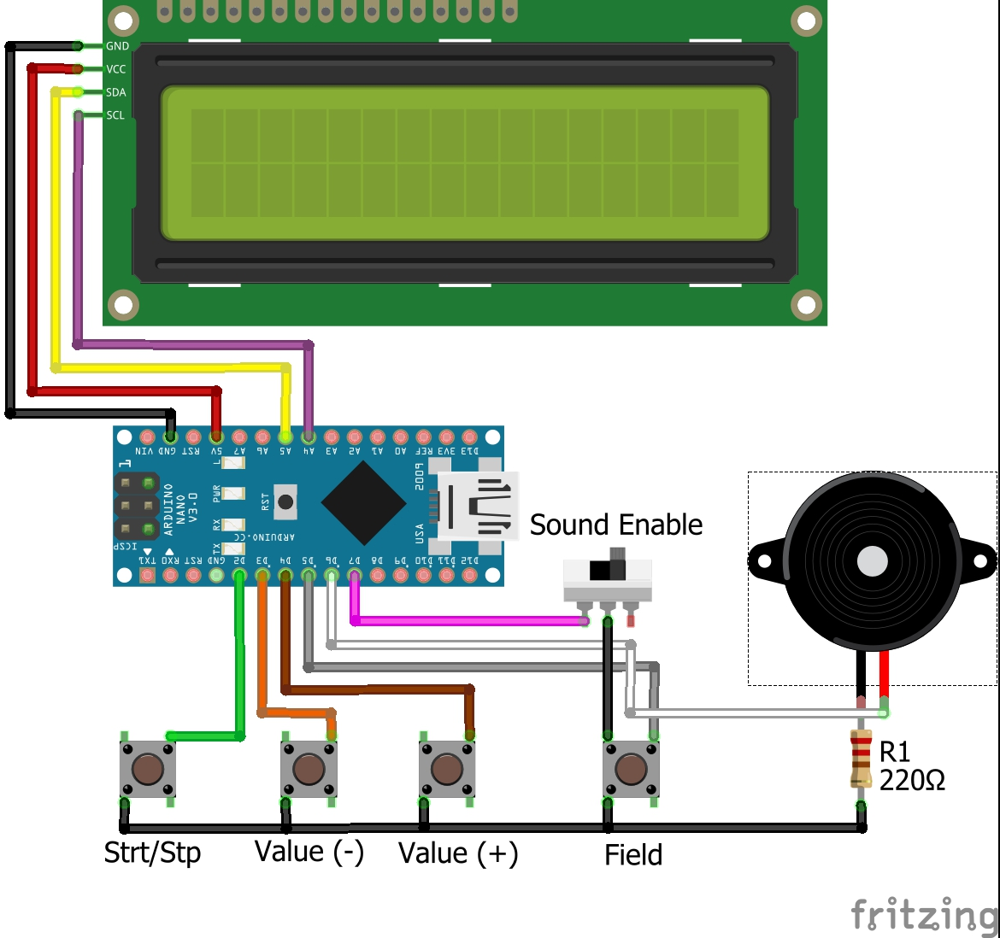

# Timer
### Using Arduino

This project makes a simple timer using an I2C LCD, a buzzer, and a couple push buttons

**Circuit:** 
NOTE: this image is not up to date with the latest code. to view compatible code, go to [this commit] (https://github.com/prog-apprentice401/Timer/tree/7474a163896589a24e8ad477e4f60df666b8acca)

